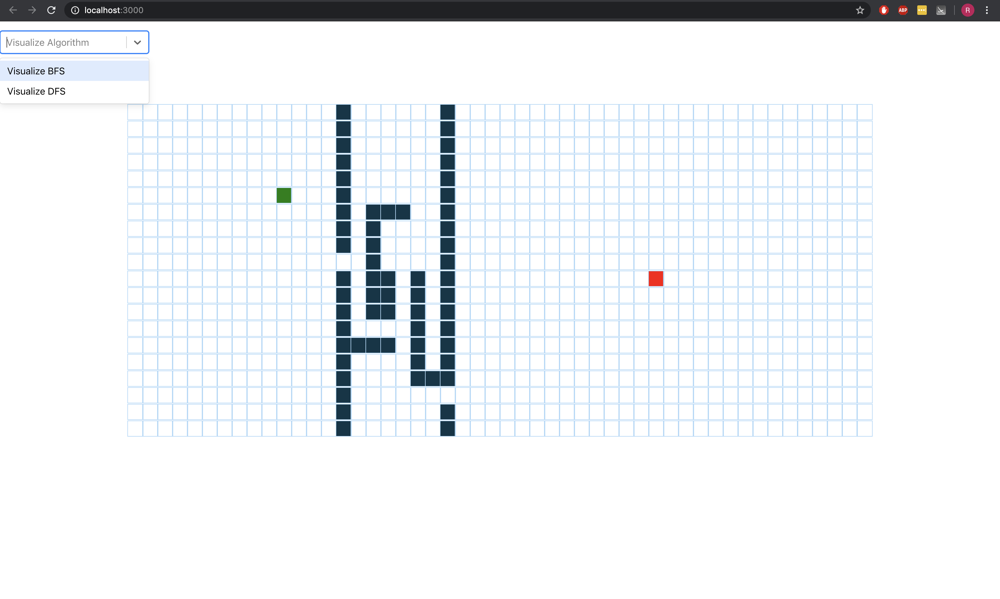
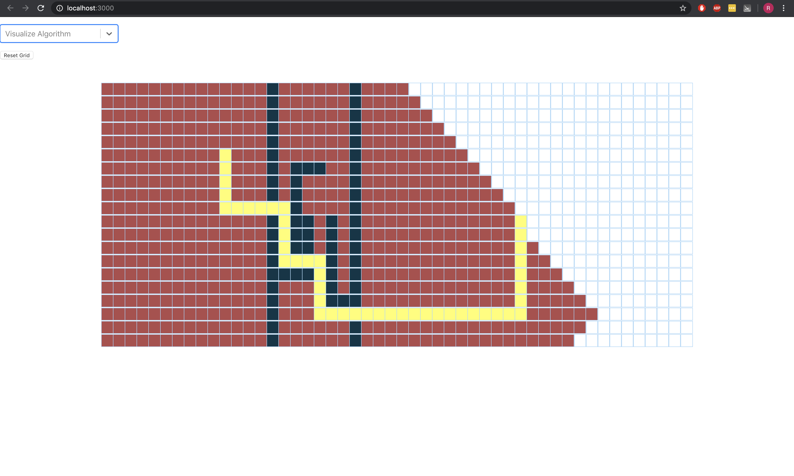

# Algorithm-Visualizer
BFS visualizer that visualizes the Breath-First-Search algorithm from the start node to the end node, while allowing the user to move the position of the start and end node and place walls. Displays the visualization of visited nodes in red and shows the shortest path in yellow.

# Screenshots
Before the BFS Visualizer is run

  

After the BFS Visualizer is run

    

